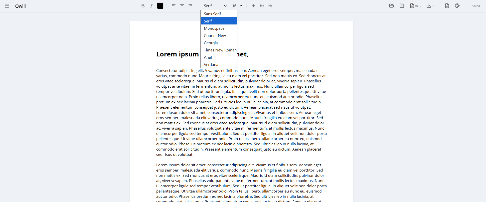

# Qwill

**A minimalist desktop word processor built with React 19 + Vite 7 + Tauri 2.**

Qwill opens, edits, and saves `.docx` files natively, exports to PDF, and ships as a ~10 MB cross-platform desktop app instead of a 200 MB Electron bundle. It's fully offline — no telemetry, no account, no network calls. [MIT licensed](LICENSE).



## Features

- **Rich text editing** — bold, italic, headings, alignment, color, multiple fonts, font sizes, zoom
- **Native file I/O** — open/save/save-as through the OS file dialog via Tauri plugins (not a browser file picker)
- **`.docx` round-trip** — imports Word documents via [`mammoth`](https://www.npmjs.com/package/mammoth), exports via [`docx`](https://www.npmjs.com/package/docx), preserving formatting through edit cycles
- **PDF export** — browser-side via [`html2pdf.js`](https://www.npmjs.com/package/html2pdf.js)
- **PDF → DOCX conversion** — handled by a Rust Tauri command using [`pdf-extract`](https://crates.io/crates/pdf-extract) and [`docx-rs`](https://crates.io/crates/docx-rs)
- **Multi-document sidebar** — switch between documents, with localStorage-backed auto-save
- **Themes** — Light, Dark, Sepia, Midnight, Forest
- **Page view with pagination** — content is rebalanced across pages as you type
- **Fully offline** — no network access required at any point

## Tech Stack

| Layer | Tool |
|-------|------|
| UI framework | React 19 |
| Build tool | Vite 7 |
| Desktop runtime | Tauri 2 (Rust) |
| Native file dialogs | `@tauri-apps/plugin-dialog` / `plugin-fs` |
| DOCX I/O | `mammoth` (read), `docx` (write) |
| PDF export | `html2pdf.js` |
| PDF → DOCX | `pdf-extract` + `docx-rs` (Rust) |
| Unit tests | Vitest |
| E2E tests | Playwright |
| Icons | `lucide-react` |

See [`PLATFORMS.md`](PLATFORMS.md) for the full architecture diagram, file-by-file key-files map, and migration history from the original Electron version (which brought app size from ~200 MB down to ~10 MB and memory usage from ~250 MB down to ~60 MB).

## Running Locally

Qwill is a desktop app. You can run it two ways — most of the time you want the desktop mode.

**Desktop mode (real Tauri app, recommended):**

```bash
npm install
npm run tauri:dev
```

On first run this will also compile the Rust backend, which takes a few minutes. Subsequent runs are fast.

**Web-only dev mode (faster iteration on pure-React changes):**

```bash
npm install
npm run dev
```

This launches just the Vite dev server in a browser. Native file dialogs and PDF-to-DOCX won't work in this mode — those require the Tauri runtime — but it's useful for rapid UI tweaking.

## Building for Release

```bash
npm run tauri:build
```

Produces platform-specific installers in `src-tauri/target/release/bundle/`:

- **Windows:** NSIS installer (`.exe`) and MSI
- **macOS:** DMG and `.app` bundle
- **Linux:** AppImage and `.deb`

## Testing

```bash
npm test                 # Vitest unit tests (48 tests covering DOCX
                         # round-trip, auto-save, file switching,
                         # themes, PDF text extraction, localStorage)

npx playwright test      # End-to-end browser tests
```

## Prerequisites

- **Node.js 20+** (for Vite 7 and Vitest 4)
- **Rust toolchain** — install via [rustup](https://rustup.rs) for Tauri builds
- Platform build dependencies as listed in the [Tauri prerequisites guide](https://v2.tauri.app/start/prerequisites/)

## Known Issues

- **Cross-page text selection** — selecting text across page boundaries with a mouse drag or `Ctrl+A` is confined to a single page. Each page is a separate `contentEditable` element, so native browser selection doesn't span them. There's an open E2E test case for this in `e2e/cross-page-selection.spec.js`.

## License

MIT — see [LICENSE](LICENSE).
